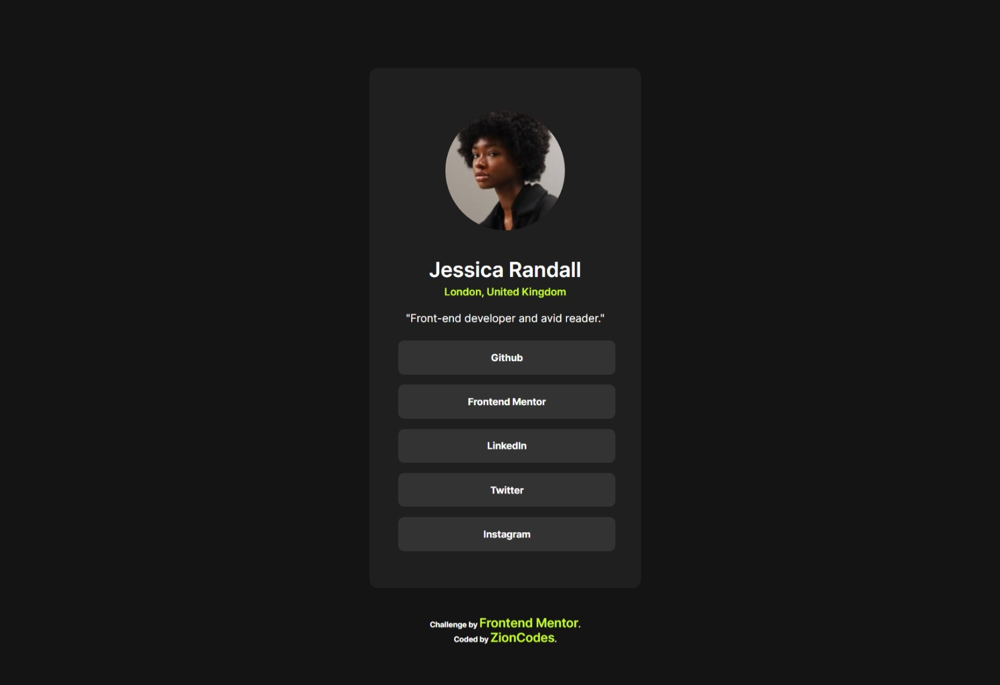

# Frontend Mentor - Social links profile solution

This is a solution to the [Social links profile challenge on Frontend Mentor](https://www.frontendmentor.io/challenges/social-links-profile-UG32l9m6dQ). Frontend Mentor challenges help you improve your coding skills by building realistic projects. 

## Table of contents

  - [Overview](#overview)
  - [The challenge](#the-challenge)
  - [Screenshot](#screenshot)
  - [Links](#links)
  - [Built with](#built-with)
  - [What I learned](#what-i-learned)
  - [Continued development](#continued-development)
  - [Useful resources](#useful-resources)
  - [Author](#author)
  - [Acknowledgments](#acknowledgments)


## Overview

## the challenge
i was challenge to build a Social Links Profile and here it is

### Screenshot




### Links

- Solution URL: [https://github.com/ZionCodes1/social-links-profile.git]
- Live Site URL: [https://golden-tulumba-57faf2.netlify.app]
## My process

### Built with

- Semantic HTML5 markup
- CSS custom properties

### What I learned

i learn a lot more about html and css, and still looking forward to learn more

```css
.att:link, .att:visited {
    font-weight: bold;
    font-family: myFirstFont2;
    font-size: 18px;
    color: hsl(75, 94%, 57%);
}
```


### Continued development

I want to learn more about how to set the @media screen well and i need a mentor, i dont mind if anyone can teach me well but i did this project myself


## Author

- Frontend Mentor - [@Zioncodes1](https://www.frontendmentor.io/profile/ZionCodes1)


## Acknowledgments

i did myself with the of the html and css i took on udemy

